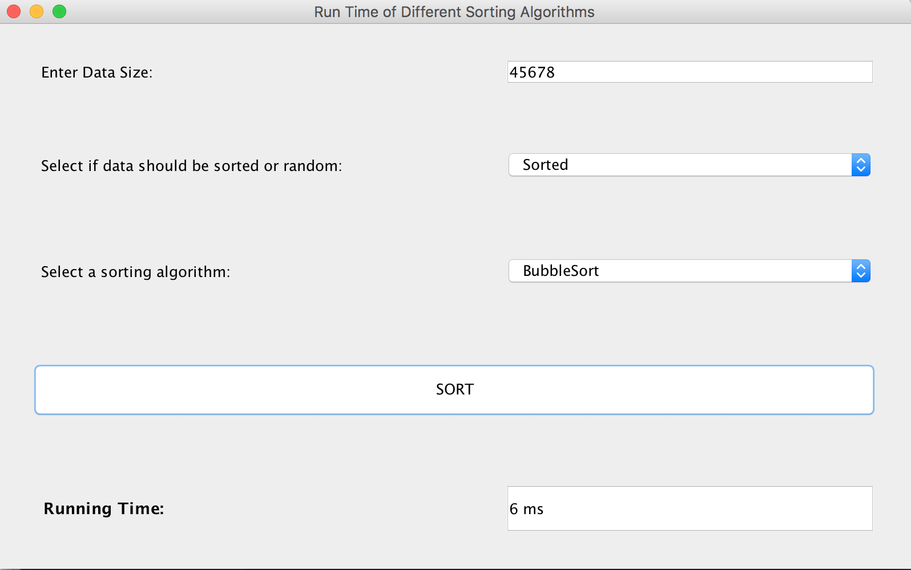

# SortingApplication
Java GUI application prompts the user to enter a data size, assume it is less than 500000. The user then selects what type of file should be 
generated, sorted or random. User also selects a sorting algorithm from one of the following options: merge sort, heap sort, quick sort, selection 
sort, bubble sort, shell sort, or insertion sort. When the user clicks the "Sort" button, the data that was generated is sorted according to the 
selected sorting algorithm and the running time is displayed.

## Application Snapshot

